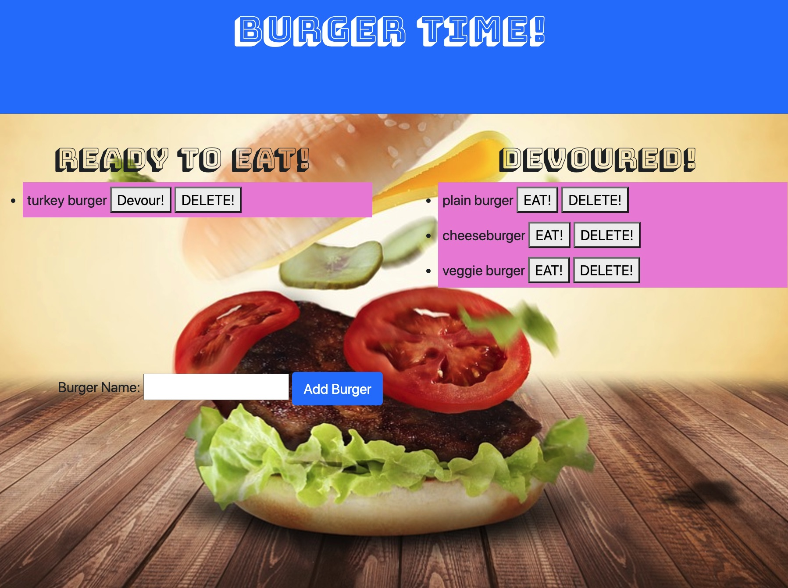

# Burger
The application is a burger logger.  One side will show Burgers ready to be eaten and the other side will show Burgers that have been devoured.  This applications allows users to move burgers from the Devoured column to Ready To Be Eaten column and vice versa.  Users can add a burger which will be added to the Ready to Eat column.  Users can either devour the burger or delete the burger at anytime.  

## Key Topics
* Template engines
* Handlebars.js
* Model-View-Controller
* Object-relational mapping

## Technology
* MySQL
* Node.js
* Express
* Heroku with JAWSdb add-on

## Links
https://quiet-atoll-23729.herokuapp.com/